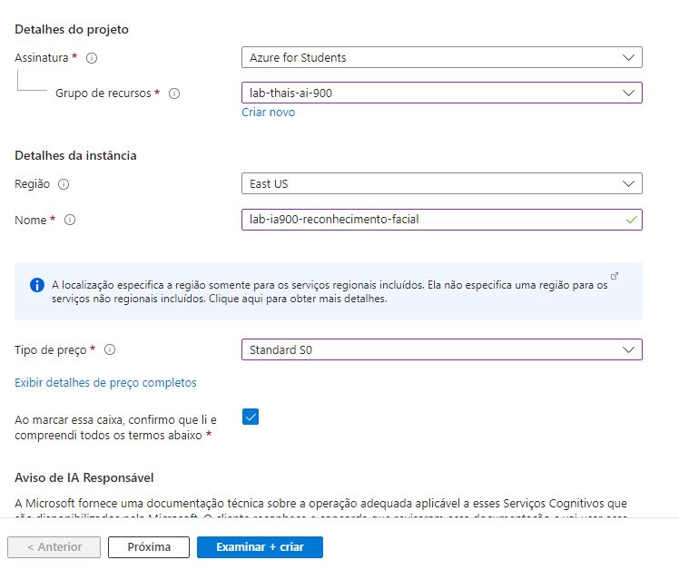
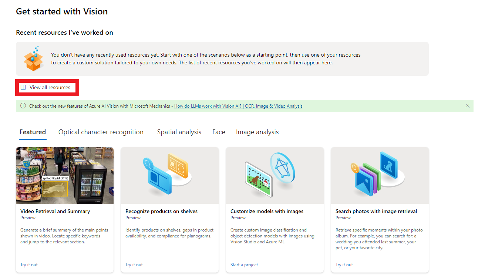
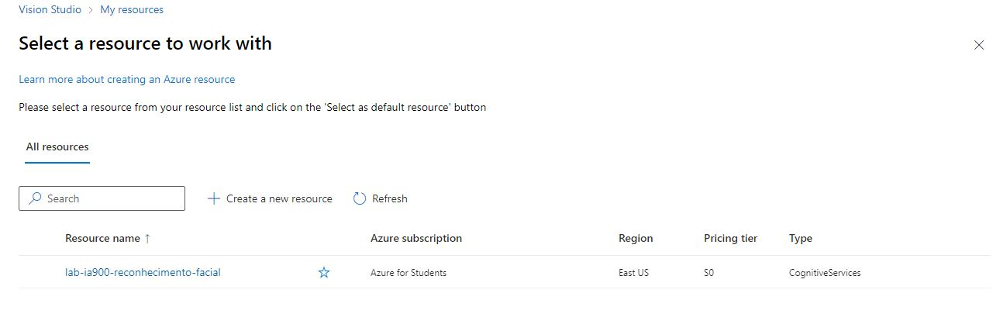
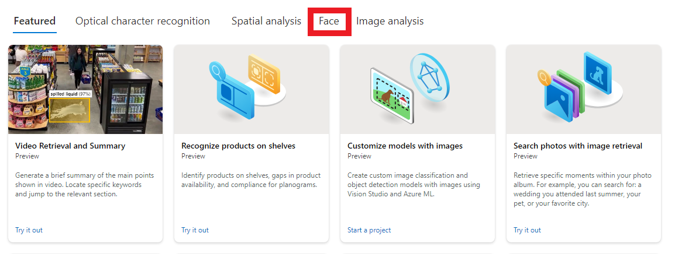
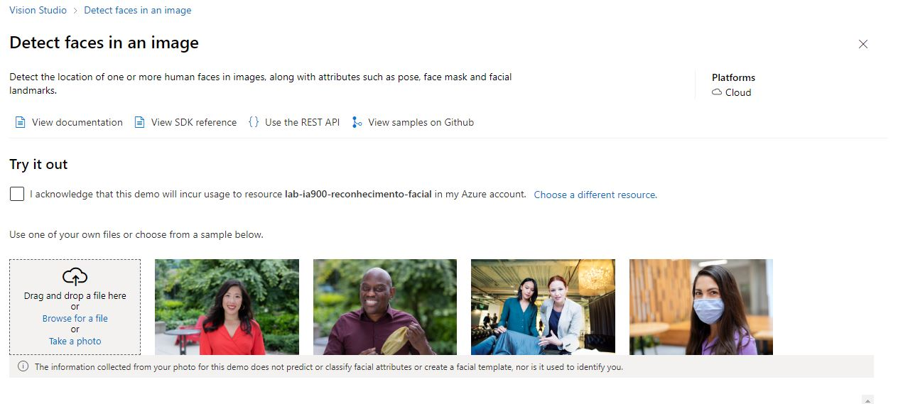
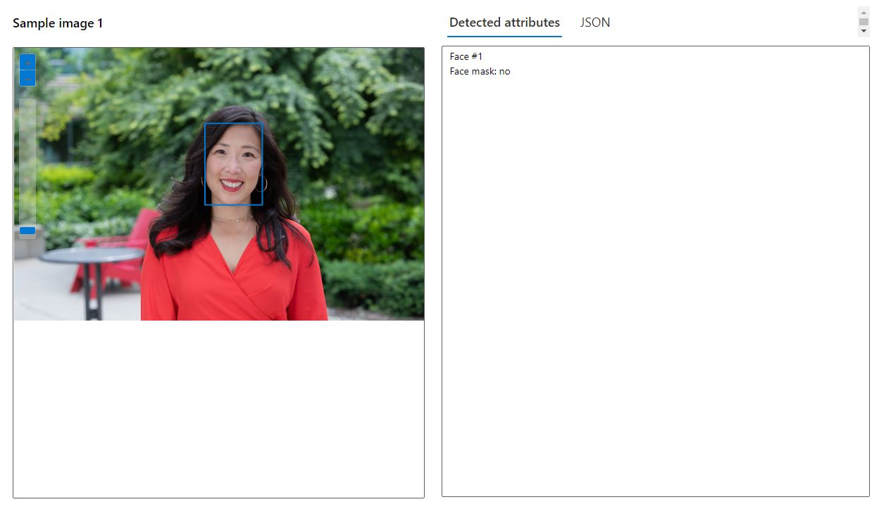
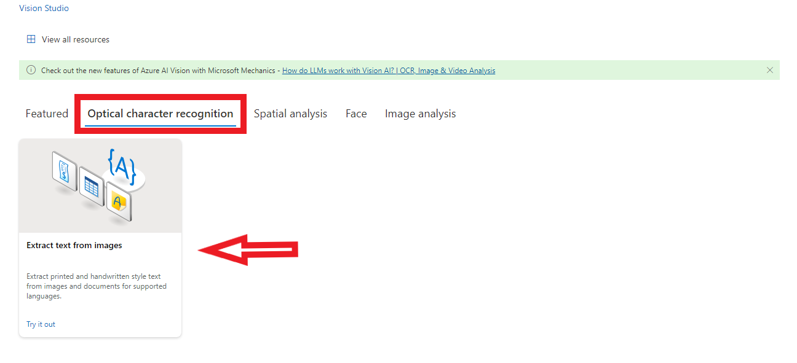
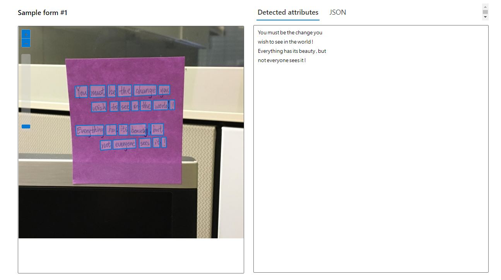

# Reconhecimento Facial e transformação de imagens em Dados no Azure ML

## Introdução

Neste laboratório foi realizado testes de reconhecimento facial em imagens, reconhecimento de caracteres em documentos e descrição de imagens.

## Projeto realizado utilizando recursos do Azure Machine Learning

Primeiro foi necessário acessar a conta no Microsoft Azure e a criação de um recurso:
    * Criar recurso - IA + Machine Learning - Serviços Cognitivos

Foi necessário preencher os dados e clicar em examinar + criar 

Após criado, acessei o link [https://portal.vision.cognitive.azure.com/gallery/featured](https://portal.vision.cognitive.azure.com/gallery/featured) e cliquei em view all resources

Fui direcionada para a página

Selecionei o recurso e cliquei em *select as default resource* e fechei a aba.

Retornei para a página seguinte e cliquei em na opção *face*

Depois cliquei na opção *Detect faces in an image*, e me direcionou para a seguinte tela

Cliquei em *i acknowledge that this demo will incur usage to resource lab-ia900-reconhecimento-facial in my Azure account*.

E realizei os testes de reconhecimento:

Após os testes de reconhecimento facial, realizei o teste de reconhecimento de caracteres

Teste realizado

